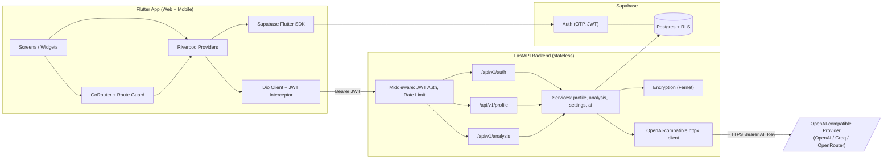
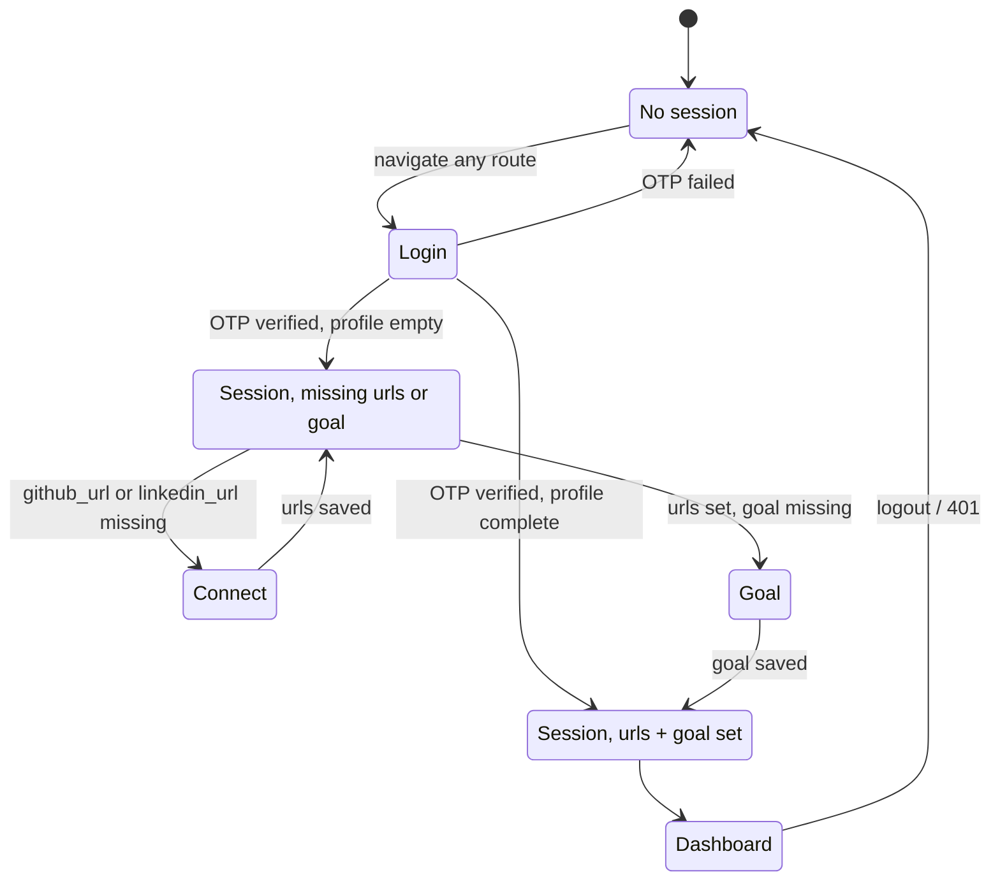
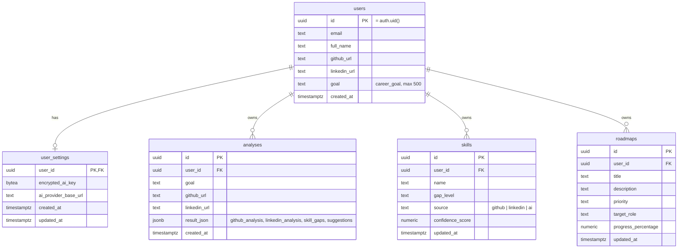
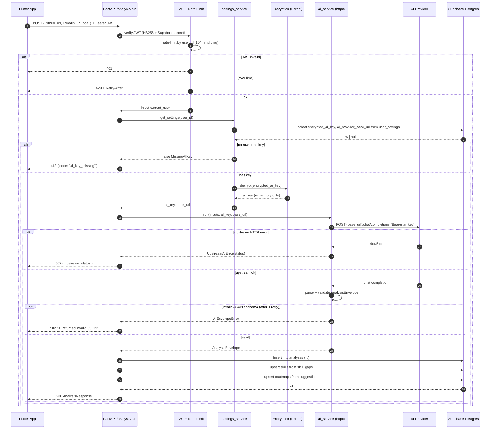

# Design Document

## Overview

DevGrowth AI is a three-tier system: a Flutter client (Web + Mobile), a stateless FastAPI backend, and a Supabase Postgres database fronted by Supabase Auth. The backend never holds session state; identity is carried in a Supabase-issued JWT on every request and verified locally with the Supabase JWT secret.

The product's core workflow is a single AI-mediated pipeline. The user supplies a GitHub URL, a LinkedIn URL, and a free-text career goal. The backend assembles a prompt, calls an OpenAI-compatible `/chat/completions` endpoint using the user's own AI key (decrypted at request time), validates the response against a strict JSON schema, persists the structured result, and returns it to the client. The client renders the result as glassmorphism cards in a dark, neon-accented dashboard.

Design priorities, in order:

1. **Security boundary discipline.** AI keys are encrypted at rest with Fernet, never returned to the client, decrypted only for the duration of a single request. RLS is enforced on every table.
2. **Provider-agnostic AI.** The backend talks to any OpenAI-compatible provider (OpenAI, Groq, OpenRouter) through a single HTTP contract.
3. **Cost containment.** Per-user sliding-window rate limiting on `/analysis/*` caps spend.
4. **Maintainability.** Feature-based layout on both ends, Pydantic schemas at the boundary on the backend, Riverpod + GoRouter on the frontend.

## Architecture

### System architecture



### Layer responsibilities

| Layer | Responsibility | Stateless? |
|---|---|---|
| Flutter app | Auth UX, routing guards, form validation, rendering, local caching of analysis | Yes (storage-backed only) |
| Supabase Auth | OTP issue/verify, JWT signing | Stateful (managed) |
| FastAPI backend | JWT verification, validation, encryption, AI orchestration, persistence | Yes |
| Supabase Postgres | Source of truth, RLS enforcement, audit timestamps | Stateful (managed) |
| AI Provider | Inference only | Stateful (external) |

## Components and Interfaces

### Backend project layout

```
app/
  main.py                       # FastAPI app, router mounting, middleware wiring
  core/
    config.py                   # Settings via pydantic-settings (env-driven)
    security.py                 # JWT verification (HS256, Supabase secret)
    supabase_client.py          # Singleton service-role Supabase Python client
    encryption.py               # Fernet wrapper using FERNET_KEY env var
  api/
    v1/
      auth.py                   # POST /verify-token
      profile.py                # GET/PATCH /profile/me, GET/PUT /settings
      analysis.py               # POST /analysis/run, GET /analysis/latest
  services/
    ai_service.py               # OpenAI-compatible client + envelope validation
    profile_service.py          # Read/write users
    analysis_service.py         # Orchestrates AI run + persistence fan-out
    settings_service.py         # Read/write user_settings, encrypt/decrypt AI key
  schemas/
    auth.py
    profile.py
    settings.py
    analysis.py                 # AnalysisRequest, AnalysisResponse, AnalysisEnvelope
  middleware/
    jwt_auth.py                 # Dependency that injects current_user from JWT
    rate_limit.py               # slowapi limiter keyed by user_id for /analysis/*
```

### Backend HTTP API (v1)

| Method | Path | Auth | Purpose |
|---|---|---|---|
| POST | `/api/v1/auth/verify-token` | JWT | Echo authenticated user record |
| GET | `/api/v1/profile/me` | JWT | Read profile for current user |
| PATCH | `/api/v1/profile/me` | JWT | Update `github_url`, `linkedin_url`, `goal` |
| GET | `/api/v1/profile/settings` | JWT | Returns `{ has_ai_key, ai_provider_base_url }` |
| PUT | `/api/v1/profile/settings` | JWT | Save AI key (encrypted) and base URL |
| POST | `/api/v1/analysis/run` | JWT, rate-limited | Run a fresh AI analysis |
| GET | `/api/v1/analysis/latest` | JWT | Most recent analysis row for user |

### Frontend project layout

```
lib/
  main.dart
  core/
    config.dart                 # API base URL, Supabase keys (anon)
    theme.dart                  # ColorScheme.dark, neon palette, gradient styles
    dio_client.dart             # Dio + JWT interceptor + 401 handler
    supabase_client.dart        # Supabase.initialize, session stream
    router.dart                 # GoRouter with redirect Route_Guard
  shared/
    widgets/
      glass_card.dart           # BackdropFilter + translucent container
      gradient_text.dart        # ShaderMask wrapper
      neon_button.dart          # Outlined button with neon glow
      shimmer_loader.dart       # Async-loading placeholder
      animated_background.dart  # flutter_animate particle field
  features/
    auth/
      data/auth_repository.dart
      domain/auth_state.dart
      presentation/login_screen.dart        # email + OTP step machine
      presentation/providers.dart           # authProvider (StreamProvider)
    onboarding/
      data/profile_repository.dart
      domain/onboarding_state.dart
      presentation/connect_profiles_screen.dart
      presentation/set_goal_screen.dart
      presentation/providers.dart           # profileProvider
    dashboard/
      data/analysis_repository.dart
      domain/analysis_models.dart
      presentation/dashboard_screen.dart
      presentation/analysis_view.dart
      presentation/skill_gap_view.dart
      presentation/suggestions_view.dart
      presentation/settings_drawer.dart
      presentation/providers.dart           # analysisProvider, settingsProvider
```

### Routing state machine (GoRouter)



The redirect function evaluates in this order:

1. `session == null` → `/login`
2. `github_url == null || linkedin_url == null` → `/connect`
3. `goal == null` → `/goal`
4. otherwise → requested route, default `/dashboard`

### Dio interceptor

- `onRequest`: read `Supabase.instance.client.auth.currentSession?.accessToken`; if present and the path is not `/auth/verify-token`, attach `Authorization: Bearer <token>`.
- `onError` for status `401`: call `supabase.auth.refreshSession()`; on success, retry the original request once with the refreshed token; on failure, clear local session, push `/login`.

### State management

| Provider | Type | Description |
|---|---|---|
| `authProvider` | `StreamProvider<Session?>` | Wraps Supabase auth state changes |
| `profileProvider` | `AsyncNotifierProvider<ProfileNotifier, Profile>` | Loads and patches `/profile/me` |
| `settingsProvider` | `AsyncNotifierProvider<SettingsNotifier, Settings>` | Loads `/profile/settings`; `has_ai_key` boolean only |
| `analysisProvider` | `FutureProvider.family<AnalysisResult, String /*goal*/>` | Calls `/analysis/run` and caches per-goal |
| `latestAnalysisProvider` | `FutureProvider<AnalysisResult?>` | Hits `/analysis/latest` for empty-state vs filled-state Dashboard |

### AI service contract

`ai_service.run(prompt_inputs, ai_key, base_url) -> AnalysisEnvelope`

- Builds messages: a system message containing the strict JSON schema instruction, and a user message containing the URLs and goal verbatim.
- POST `{base_url}/chat/completions` with body `{ "model": settings.ai_model, "messages": [...], "response_format": {"type": "json_object"}, "temperature": 0.2 }`.
- Header: `Authorization: Bearer {ai_key}`, `Content-Type: application/json`.
- Timeout: 30 s. On `httpx.HTTPStatusError` from upstream → raise `UpstreamAIError(status_code, body)`.
- Parse `choices[0].message.content` as JSON, then validate via `AnalysisEnvelope` Pydantic model.
- On `JSONDecodeError` or `ValidationError`: retry once with an additional system message reminding the model of the schema. On second failure, raise `AIEnvelopeError`.

### Encryption service

```python
class EncryptionService:
    def __init__(self, fernet_key: bytes):
        self._fernet = Fernet(fernet_key)
    def encrypt(self, plaintext: str) -> bytes:
        return self._fernet.encrypt(plaintext.encode("utf-8"))
    def decrypt(self, token: bytes) -> str:
        return self._fernet.decrypt(token).decode("utf-8")
```

`FERNET_KEY` is a 32-byte url-safe base64 value loaded from env. Rotation is supported by accepting a list of keys (`MultiFernet`) ordered newest-first.

### Rate limiter

- Library: `slowapi` with sliding-window counter backed by in-process memory in dev, Redis in prod.
- Key function: `lambda req: req.state.user.id` (set by the JWT dependency). For unauthenticated requests, the rate limiter is skipped and the JWT dependency rejects with 401.
- Limit: `10/minute` on every route under `/api/v1/analysis`.
- Response on exceed: `429` with `Retry-After: <seconds remaining in window>`.

## Data Models

### Pydantic schemas (boundary types)

```python
# schemas/profile.py
class ProfileOut(BaseModel):
    id: UUID
    email: EmailStr
    full_name: str | None
    github_url: HttpUrl | None
    linkedin_url: HttpUrl | None
    goal: str | None
    created_at: datetime

class ProfilePatch(BaseModel):
    github_url: HttpUrl | None = None
    linkedin_url: HttpUrl | None = None
    goal: str | None = Field(default=None, min_length=1, max_length=500)

# schemas/settings.py
class SettingsOut(BaseModel):
    has_ai_key: bool
    ai_provider_base_url: HttpUrl

class SettingsIn(BaseModel):
    ai_key: str = Field(min_length=8)
    ai_provider_base_url: HttpUrl

# schemas/analysis.py
class AnalysisRequest(BaseModel):
    github_url: HttpUrl
    linkedin_url: HttpUrl
    goal: str = Field(min_length=1, max_length=500)

class SkillGap(BaseModel):
    name: str
    gap_level: Literal["low", "medium", "high"]
    rationale: str

class Suggestion(BaseModel):
    title: str
    description: str
    priority: Literal["low", "medium", "high"]

class AnalysisEnvelope(BaseModel):
    github_analysis: dict
    linkedin_analysis: dict
    skill_gaps: list[SkillGap]
    suggestions: list[Suggestion]

class AnalysisResponse(AnalysisEnvelope):
    id: UUID
    created_at: datetime
```

`HttpUrl` enforces scheme; an additional validator rejects non-HTTPS for `github_url`, `linkedin_url`, and `ai_provider_base_url`.

### Database ER diagram



### RLS policies

For each of `users`, `user_settings`, `analyses`, `skills`, `roadmaps`:

```sql
alter table <t> enable row level security;
create policy <t>_select on <t> for select using (auth.uid() = user_id);
create policy <t>_insert on <t> for insert with check (auth.uid() = user_id);
create policy <t>_update on <t> for update using (auth.uid() = user_id) with check (auth.uid() = user_id);
create policy <t>_delete on <t> for delete using (auth.uid() = user_id);
```

For the `users` table the column is `id`, so substitute `auth.uid() = id`.

### handle_new_user trigger

```sql
create or replace function public.handle_new_user()
returns trigger language plpgsql security definer as $$
begin
  insert into public.users (id, email)
  values (new.id, new.email)
  on conflict (id) do nothing;
  return new;
end; $$;

create trigger on_auth_user_created
  after insert on auth.users
  for each row execute function public.handle_new_user();
```

## Data Flow — POST /api/v1/analysis/run



## Error Handling

| Condition | Status | Body |
|---|---|---|
| Missing/expired/invalid JWT | 401 | `{ "detail": "invalid_token" }` |
| Validation failure on request body or URL | 422 | FastAPI default field-level errors |
| Missing AI key | 412 | `{ "code": "ai_key_missing", "detail": "Set your AI key in Settings" }` |
| Upstream AI HTTP error | 502 | `{ "code": "upstream_ai_error", "upstream_status": <int>, "detail": "<redacted>" }` |
| AI returned invalid JSON after retry | 502 | `{ "code": "ai_invalid_json", "detail": "AI returned invalid JSON" }` |
| Rate limit exceeded | 429 | `{ "code": "rate_limited" }`, header `Retry-After: <int>` |
| RLS denied write | 403 | `{ "detail": "forbidden" }` |

Frontend mapping: 401 triggers session refresh then logout-on-failure; 412 routes the user to the Settings drawer with a banner; 429 surfaces a snackbar with the `Retry-After` countdown; 502 shows a retry CTA on the Dashboard.

## Correctness Pre-Work

The full pre-work analysis was recorded via the prework tool. Summary classifications:

- **PROPERTY**: 1.3, 1.5, 2.2, 2.4, 3.1, 3.4, 3.5, 4.2, 4.3, 4.4, 4.5, 4.6, 4.8, 5.1, 5.2, 5.3, 5.4, 6.2, 6.5, 6.6, 6.7, 7.1, 7.2, 7.3, 8.7, 9.3, 9.6, 10.6, 11.3, 11.4
- **EXAMPLE**: 1.1, 1.2, 1.4, 1.6, 2.1, 2.3, 2.5, 3.2, 3.3, 4.1, 5.5, 6.3, 6.4, 11.1, 11.2
- **EDGE_CASE**: 4.7
- **SMOKE**: 6.1, 8.1, 8.2, 8.3, 8.4, 8.5, 8.6, 9.1, 9.2, 10.1, 10.2, 10.3, 10.4, 10.5
- **INTEGRATION**: (none — no third-party-service-only requirements)
- **NOT TESTABLE**: 9.4, 9.5 (consolidated into 3.1, 1.3 respectively)

After reflection, redundant properties were consolidated:

- 1.3 and 9.5 → single Dio JWT-attachment property.
- 3.1 and 9.4 → single incomplete-profile redirect property.
- 4.1 and 4.3 → single property covering decryption + outbound key transmission.

## Correctness Properties

*A property is a characteristic or behavior that should hold true across all valid executions of a system — essentially, a formal statement about what the system should do. Properties serve as the bridge between human-readable specifications and machine-verifiable correctness guarantees.*

### Property 1: Bearer JWT on every authenticated client request

For any outbound HTTP request the Flutter Dio client issues to the Backend_API on a path other than `/api/v1/auth/verify-token` while a Supabase session exists, the request carries an `Authorization: Bearer <accessToken>` header equal to the current session's access token.

**Validates: Requirements 1.3, 9.5**

### Property 2: Backend rejects every malformed or missing JWT

For any request to a protected route under `/api/v1/` whose `Authorization` header is missing, malformed, signed with the wrong key, or carries an `exp` in the past, the Backend_API responds with HTTP status 401.

**Validates: Requirements 1.5**

### Property 3: PATCH /profile/me is a write-then-read identity

For any authenticated user and any valid subset `P` of `{github_url, linkedin_url, goal}`, after `PATCH /profile/me` with body `P`, the subsequent `GET /profile/me` response equals the prior profile merged with `P`.

**Validates: Requirements 2.2, 2.3**

### Property 4: Non-HTTPS profile URLs are rejected

For any string that is not a syntactically valid HTTPS URL, including `http://` and non-URL strings, submitting it as `github_url` or `linkedin_url` to `PATCH /profile/me` yields HTTP 422 with a field-level error naming the offending field.

**Validates: Requirements 2.4**

### Property 5: Incomplete onboarding always redirects to onboarding

For any authenticated session whose profile has `github_url == null`, `linkedin_url == null`, or `goal == null`, navigation to any protected route resolves through the Route_Guard to `/connect` (when a URL is missing) or `/goal` (when only the goal is missing).

**Validates: Requirements 3.1, 9.4**

### Property 6: Goal validation rejects empty and oversize input

For any string that is empty, contains only whitespace, or has length greater than 500, the Set Goal screen displays an inline validation error and issues no HTTP request to the Backend_API.

**Validates: Requirements 3.4**

### Property 7: Complete onboarding routes to Dashboard

For any authenticated session whose profile has non-null `github_url`, `linkedin_url`, and `goal`, navigation to any non-auth route resolves through the Route_Guard to `/dashboard` unless the user explicitly requested another protected route.

**Validates: Requirements 3.5**

### Property 8: Analysis runs make exactly one outbound AI call with the user's key

For any analysis run with valid inputs and a configured AI key, the backend issues exactly one outbound HTTPS POST whose URL equals `{ai_provider_base_url}/chat/completions` and whose `Authorization` header equals `Bearer <decrypted_ai_key>`. No request is made to the GitHub REST API or to LinkedIn.

**Validates: Requirements 4.1, 4.2, 4.3**

### Property 9: Every prompt enforces the analysis JSON schema

For any analysis run, the request body sent to the AI provider contains, in its `messages`, an instruction string that names every key of the analysis envelope (`github_analysis`, `linkedin_analysis`, `skill_gaps`, `suggestions`) and requests JSON output.

**Validates: Requirements 4.4**

### Property 10: Schema-valid AI responses round-trip to the client

For any AI response whose body parses against `AnalysisEnvelope`, the `POST /analysis/run` response has status 200 and a JSON body that, when re-parsed, equals the AI envelope (modulo persistence-added fields `id` and `created_at`).

**Validates: Requirements 4.5**

### Property 11: Malformed AI responses retry once and then fail with 502

For any AI response that fails JSON parsing or `AnalysisEnvelope` validation, the backend issues exactly one retry to the provider; if that retry also fails validation, the backend responds with HTTP 502 and an error code identifying schema failure.

**Validates: Requirements 4.6**

### Property 12: Upstream AI errors map to 502 with the upstream status echoed

For any non-2xx HTTP response received from the AI provider, the `POST /analysis/run` response has status 502 and a JSON body whose `upstream_status` field equals the provider's status code.

**Validates: Requirements 4.8**

### Property 13: Successful runs persist exactly one analyses row with matching inputs

For any analysis run that returns 200, the `analyses` table contains exactly one new row for the requesting user whose `goal`, `github_url`, `linkedin_url` columns equal the request, and whose `result_json` equals the response envelope.

**Validates: Requirements 5.1**

### Property 14: Skill and roadmap upserts are union-preserving

For any successful analysis with `skill_gaps = G` and `suggestions = S`, after persistence the `skills` table contains every distinct entry of `G` for the user (no duplicates by name) and the `roadmaps` table contains every distinct entry of `S` for the user (no duplicates by title).

**Validates: Requirements 5.2, 5.3**

### Property 15: GET /analysis/latest returns the most recently created row

For any user with one or more analyses, `GET /analysis/latest` returns the row with the maximum `created_at` for that user.

**Validates: Requirements 5.4**

### Property 16: AI key encryption round-trips and never stores plaintext

For any non-empty AI key string `k`, after `PUT /profile/settings` with `ai_key = k`: (a) reading the `user_settings.encrypted_ai_key` column yields bytes that are not equal to `utf8(k)` and not a substring of `k`; and (b) the settings service's internal decrypt of those bytes returns exactly `k`.

**Validates: Requirements 6.2**

### Property 17: No backend response body ever contains the AI key

For any user with a stored AI key `k` and any request to any Backend_API endpoint, the response body's serialized form does not contain `k` as a substring.

**Validates: Requirements 6.5**

### Property 18: GET /profile/settings exposes only metadata

For any settings row, `GET /profile/settings` returns a body whose keys are exactly `{has_ai_key, ai_provider_base_url}`, with `has_ai_key` equal to whether `encrypted_ai_key` is non-null, and never contains the AI key in any form.

**Validates: Requirements 6.6**

### Property 19: Non-HTTPS provider base URLs are rejected

For any string that is not a syntactically valid HTTPS URL, submitting it as `ai_provider_base_url` to `PUT /profile/settings` yields HTTP 422.

**Validates: Requirements 6.7**

### Property 20: Sliding-window rate limit caps accepted analysis requests

For any authenticated user and any sequence of timestamps within any 60-second window, the number of requests to `/api/v1/analysis/*` that the Rate_Limiter admits without 429 is at most 10.

**Validates: Requirements 7.1**

### Property 21: Over-limit requests return 429 with Retry-After

For any 11th-or-later request from a user within a 60-second window on `/api/v1/analysis/*`, the response has status 429 and a `Retry-After` header set to a non-negative integer equal to the seconds until the user's window resets.

**Validates: Requirements 7.2**

### Property 22: Rate limiter never overrides 401 for unauthenticated requests

For any unauthenticated request to `/api/v1/analysis/*`, regardless of frequency, the response status is 401 and is never 429.

**Validates: Requirements 7.3**

### Property 23: RLS isolates every user's data on every CRUD operation

For any two distinct authenticated users `A` and `B` and any of the tables `{users, user_settings, analyses, skills, roadmaps}`, a query executed under user `A`'s JWT cannot SELECT, INSERT (with `user_id = B.id`), UPDATE, or DELETE rows whose `user_id` (or `id` for the `users` table) equals `B.id`; and the same query restricted to `A`'s own rows succeeds.

**Validates: Requirements 8.7**

### Property 24: Unauthenticated navigation always lands on /login

For any application route in any state where `Supabase.auth.currentSession == null`, the GoRouter Route_Guard resolves the navigation to `/login`.

**Validates: Requirements 9.3**

### Property 25: 401 responses clear session and route to /login

For any HTTP response with status 401 received by the Dio interceptor (after a single refresh attempt has also failed), the local Supabase session is cleared and the router's current location becomes `/login`.

**Validates: Requirements 9.6**

### Property 26: Async-loading UI always renders a shimmer placeholder

For any widget bound to an `AsyncValue` whose state is `loading`, the widget tree contains a `ShimmerLoader` placeholder in place of the pending content.

**Validates: Requirements 10.6**

### Property 27: AI key input is masked and never pre-filled

For any settings state passed to the Settings drawer, the AI_Key `TextField` has `obscureText == true` and its controller's text equals the empty string.

**Validates: Requirements 11.3**

### Property 28: "Key configured" indicator tracks has_ai_key

For any settings state, the "Key configured" indicator widget is present in the Settings drawer if and only if `settings.has_ai_key == true`.

**Validates: Requirements 11.4**

## Testing Strategy

Testing pyramid, bottom-up:

### Unit tests

- **Backend (`pytest`)**:
  - `core/security.py`: HS256 verification with the configured secret; tampered/expired/missing tokens.
  - `core/encryption.py`: Fernet round-trip; ciphertext disjoint from plaintext.
  - `services/ai_service.py`: prompt assembly; envelope parsing; one-retry policy; upstream error translation. Mocked with `httpx.MockTransport`.
  - `services/settings_service.py`: encrypt-on-write, decrypt-on-read, `has_ai_key` derivation.
  - `services/analysis_service.py`: persistence fan-out into `analyses`, `skills`, `roadmaps` with a Supabase client double.
- **Frontend (`flutter_test`)**:
  - Each screen has a widget test using `mocktail` doubles for `Dio` and the Supabase client.
  - Route guard pure-function tests for the redirect decisions in the state diagram above.
  - Theme/widget tests verifying glassmorphism, gradient text, shimmer, animated background widgets render in their intended slots.

### Property-based tests

- Backend: `hypothesis` for properties 2, 3, 4, 8, 9, 10, 11, 12, 13, 14, 15, 16, 17, 18, 19, 20, 21, 22, 23.
- Frontend: `glados` (or hand-rolled generators on top of `flutter_test`) for properties 1, 5, 6, 7, 24, 25, 26, 27, 28.
- Each property test runs at least 100 iterations.
- Each property test is tagged `Feature: devgrowth-ai, Property <N>: <property text>` and references the design property number in a docstring.

### Integration tests

- One end-to-end happy-path test that boots the FastAPI app under TestClient, points the AI HTTP client at a `httpx.MockTransport` returning a canned schema-valid response, and exercises:
  Login → PATCH profile → PUT settings → POST `/analysis/run` → GET `/analysis/latest`.
- Supabase RLS tests run against a local Supabase project: two users, each table, four operations.
- A `cdk synth`–style smoke test on database migrations confirms tables, columns, RLS toggles, and policies exist (covers SMOKE-classified criteria 8.1–8.6).

### Test balance

- Unit tests focus on specific examples, error mappings (e.g., 412 on missing key), and edge cases.
- Property tests cover universal invariants (round-trips, validation, rate limiting, RLS isolation).
- Integration tests cover wiring and one full user journey; they are intentionally few.
